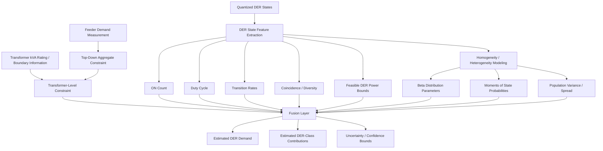

```mermaid

flowchart TB

%% ======================
%% TOP-DOWN CONSTRAINTS
%% ======================

A[Feeder Demand Measurement] --> B[Top-Down Aggregate Constraint]

C[Transformer kVA Rating / Boundary Information] --> D[Transformer-Level Constraint]
B --> D

%% ======================
%% BOTTOM-UP DER STATES
%% ======================

E[Quantized DER States] --> F[DER State Feature Extraction]

F --> F1[ON Count]
F --> F2[Duty Cycle]
F --> F3[Transition Rates]
F --> F4[Coincidence / Diversity]
F --> F5[Feasible DER Power Bounds]

%% ======================
%% HOMOGENEITY / HETEROGENEITY
%% ======================

F --> G[Homogeneity / Heterogeneity Modeling]

G --> G1[Beta Distribution Parameters]
G --> G2[Moments of State Probabilities]
G --> G3[Population Variance / Spread]

%% ======================
%% FUSION
%% ======================

D --> H[Fusion Layer]

F1 --> H
F2 --> H
F3 --> H
F4 --> H
F5 --> H

G1 --> H
G2 --> H
G3 --> H

%% ======================
%% OUTPUTS
%% ======================

H --> I[Estimated DER Demand]
H --> J[Estimated DER-Class Contributions]
H --> K[Uncertainty / Confidence Bounds]
```