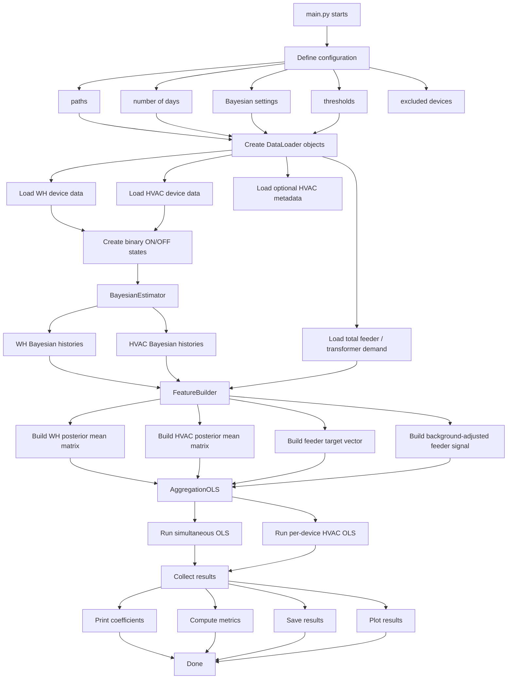

```mermaid
flowchart TD;
    A["main.py starts"] --> B["Define configuration"]

    B --> B1["paths"]
    B --> B2["number of days"]
    B --> B3["Bayesian settings"]
    B --> B4["thresholds"]
    B --> B5["excluded devices"]

    B1 --> C["Create DataLoader objects"]
    B2 --> C
    B3 --> C
    B4 --> C

    C --> D1["Load WH device data"]
    C --> D2["Load HVAC device data"]
    C --> D3["Load total feeder / transformer demand"]
    C --> D4["Load optional HVAC metadata"]

    D1 --> E["Create binary ON/OFF states"]
    D2 --> E

    E --> F["BayesianEstimator"]

    F --> F1["WH Bayesian histories"]
    F --> F2["HVAC Bayesian histories"]

    F1 --> G["FeatureBuilder"]
    F2 --> G
    D3 --> G

    G --> G1["Build WH posterior mean matrix"]
    G --> G2["Build HVAC posterior mean matrix"]
    G --> G3["Build feeder target vector"]
    G --> G4["Build background-adjusted feeder signal"]

    G1 --> H["AggregationOLS"]
    G2 --> H
    G3 --> H
    G4 --> H

    H --> I1["Run simultaneous OLS"]
    H --> I2["Run per-device HVAC OLS"]

    I1 --> J["Collect results"]
    I2 --> J

    J --> K1["Print coefficients"]
    J --> K2["Compute metrics"]
    J --> K3["Save results"]
    J --> K4["Plot results"]

    K1 --> L["Done"]
    K2 --> L
    K3 --> L
    K4 --> L
```
